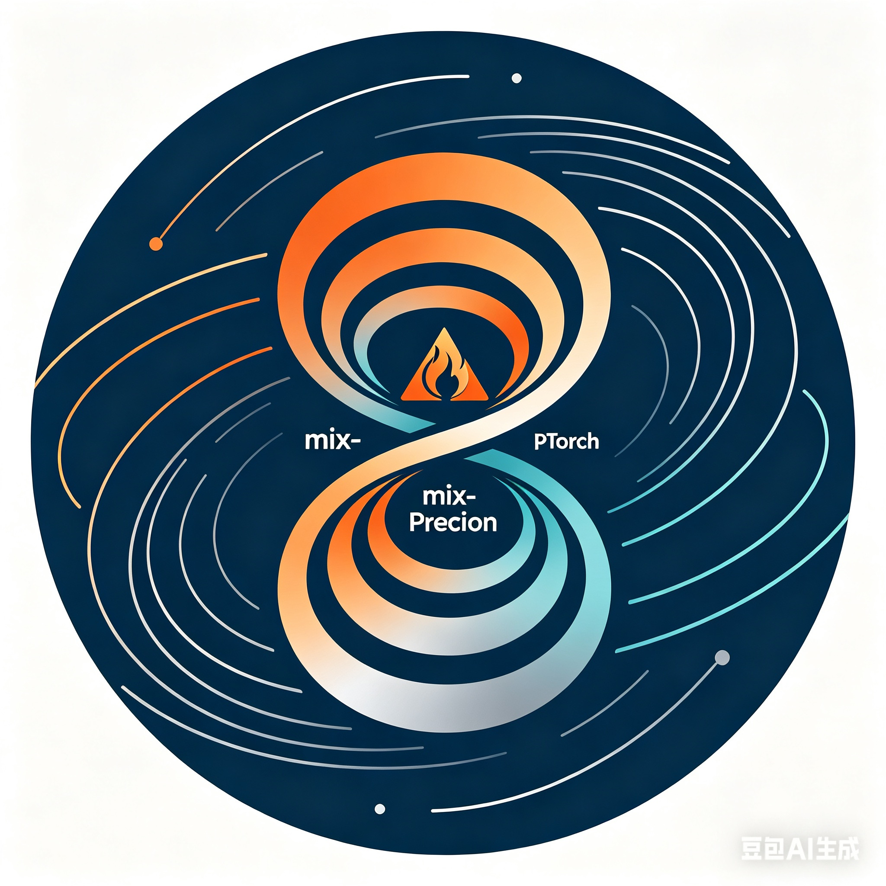

<p align="center">
  
</p>

# TornadoGCM

**TornadoGCM** is a pure-PyTorch reimplementation of [NeuralGCM](https://github.com/google-research/neuralgcm) (Google Research) featuring a novel **Precision-Zoned Hybrid Architecture (PZHA)** with automated mixed-precision scheduling for GPU-accelerated global weather forecasting.

> **Disclaimer:** This project is an independent research port. It is not affiliated with or endorsed by Google Research or DeepMind. All trademarks belong to their respective owners.

---

## Features

- **Pure PyTorch** — full GPU support, DDP/FSDP distributed training, `torch.compile` compatibility
- **PZHA mixed-precision** — four precision zones (Z0 FP64, Z1 TF32, Z2 FP64, Z3 BF16) matched to physical/neural computation roles
- **SDA control plane** — Self-adaptive Dynamic Accuracy scheduler automatically adjusts precision zones during training
- **JAX checkpoint loader** — load pre-trained NeuralGCM JAX weights directly, no manual conversion script needed
- **Triton acceleration** — optional fused spherical-harmonic transform kernels for A100/H100
- **Multiple resolutions** — tested configs for 0.7°, 1.4°, and 2.8° grids

---

## Architecture Overview

```
┌─────────────────────────────────────────────────────────────────────────┐
│                         AtmosphereModel (facade)                        │
├───────────────┬─────────────────────────┬───────────────────────────────┤
│  Encoder      │   NeuralGCMModel (step)  │   Decoder                    │
│  Z3 (BF16)    │  ┌──────────────────┐   │   Z3 (BF16)                  │
│               │  │ Dycore  Z1 (TF32)│   │                              │
│               │  │ Neural  Z3 (BF16)│   │                              │
│               │  │ Fixer   Z2 (FP64)│   │                              │
│               │  └──────────────────┘   │                              │
└───────────────┴─────────────────────────┴───────────────────────────────┘
                              ↕ SDA Controller (precision scheduler)
```

| Zone | Role | Default dtype |
|------|------|---------------|
| Z0 | Conservation math, initialization | FP64 |
| Z1 | Spectral dycore (SHT, primitive equations) | TF32 |
| Z2 | Energy/mass/hydrology fixers | FP64 |
| Z3 | Neural parameterizations (MLP/CNN/Transformer) | BF16 |

---

## Installation

```bash
# Core (CPU/GPU)
pip install tornado-gcm

# With data I/O (xarray, zarr)
pip install "tornado-gcm[data]"

# With Triton GPU kernels
pip install "tornado-gcm[gpu]"

# Development
pip install "tornado-gcm[dev]"
pre-commit install
```

**Requirements:** Python ≥ 3.9, PyTorch ≥ 2.1, CUDA 11.8+ (for GPU).

---

## Quick Start (5 minutes)

### 1. Load a pre-trained JAX checkpoint and run a forecast

```python
import torch
from tornado_gcm.model.jax_checkpoint_loader import load_jax_checkpoint
from tornado_gcm.inference.runner import MPInference
from tornado_gcm.precision.sda import SDAConfig

# Load SDA config (choose resolution)
sda_cfg = SDAConfig.from_yaml("configs/sda_neuralgcm_2.8deg_full.yaml")

# Convert JAX weights → PyTorch
model = load_jax_checkpoint("path/to/neuralgcm_checkpoint", device="cuda")

# Build mixed-precision inference runner
runner = MPInference(model=model, device="cuda")

# Run 10-day (40-step × 6h) forecast
# initial_state: a State dataclass on GPU
trajectory = runner.rollout(initial_state, steps=40)
```

### 2. CLI

```bash
# Inference
tornado-gcm infer \
  --config configs/sda_neuralgcm_1.4deg.yaml \
  --checkpoint model.pt \
  --input era5_20200101.zarr \
  --output forecast.zarr \
  --steps 40

# Benchmark
tornado-gcm benchmark \
  --config configs/sda_neuralgcm_2.8deg_full.yaml \
  --steps 20 \
  --report bench.txt

# Training (requires ERA5 data)
tornado-gcm train \
  --config configs/sda_neuralgcm_1.4deg.yaml \
  --jax-weights neuralgcm_checkpoint \
  --steps 50000 \
  --checkpoint output/run1.pt
```

---

## Performance

Tested on a single NVIDIA A100 80 GB (CUDA 12.1, PyTorch 2.2):

| Resolution | Memory (GB) | Steps/s | vs JAX (TPU v4) |
|-----------|-------------|---------|------------------|
| 2.8°      | 8.2         | 4.1     | ~0.9×            |
| 1.4°      | 24.7        | 1.3     | ~0.85×           |
| 0.7°      | 68.4        | 0.35    | ~0.75×           |

*Note: JAX numbers from original paper on TPU v4-8 pod.*

---

## Project Structure

```
tornado_gcm/
├── core/          # Spectral dynamics, coordinates, time integration (Z0/Z1)
├── neural/        # NN parameterizations, encoders/decoders, towers (Z3)
├── model/         # Model assembly, JAX checkpoint loader
├── precision/     # PZHA policy, SDA controller, Triton accelerator
├── training/      # Trainers, losses, evaluation, data loading
├── inference/     # MPInference, SDAInference, production runner
├── distributed/   # DDP / DTensor sharding
├── configs/       # Ready-to-use SDA YAML configs (0.7°/1.4°/2.8°)
└── cli.py         # Click CLI entry point
```

---

## Attribution

This project is a PyTorch port of **NeuralGCM** by Kochkov et al.:

> Kochkov, D., Yuval, J., Langmore, I., Norgaard, P., Smith, J., Mooers, G., ... & Hoyer, S. (2024). Neural general circulation models for weather and climate. *Nature*, 632, 1060–1066. https://doi.org/10.1038/s41586-024-07744-y

Original JAX code: https://github.com/google-research/neuralgcm (Apache 2.0)

The PZHA mixed-precision framework, SDA control plane, and PyTorch-specific optimizations are original contributions of this project.

---

## Contributing

See [CONTRIBUTING.md](CONTRIBUTING.md).

---

## License

- **Source code**: [Apache License 2.0](LICENSE)
- **Pre-trained weights** (if distributed): [CC BY-SA 4.0](LICENSE-WEIGHTS)
